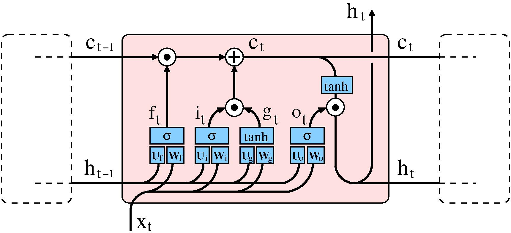

# Introduction 

This report is a demonstration of a bidirectional LSTM recurrent neural network that I had developed with the use of PyTorch. This was a project that I had completed for the *Neural Networks, Deep Learning* subject as part of my university Master of Data Science program. Our network was required to learn to read business reviews in text format and predict a rating (positive or negative) associated with each review, as well as a business category (0=Restaurants, 1=Shopping, 2=Home Services, 3=Health & Medical, 4=Automotive). The training dataset as well as all the codes can be found on my [GitHub repository](https://github.com/carimo198/writing-neural-networks-with-pytorch). 

 